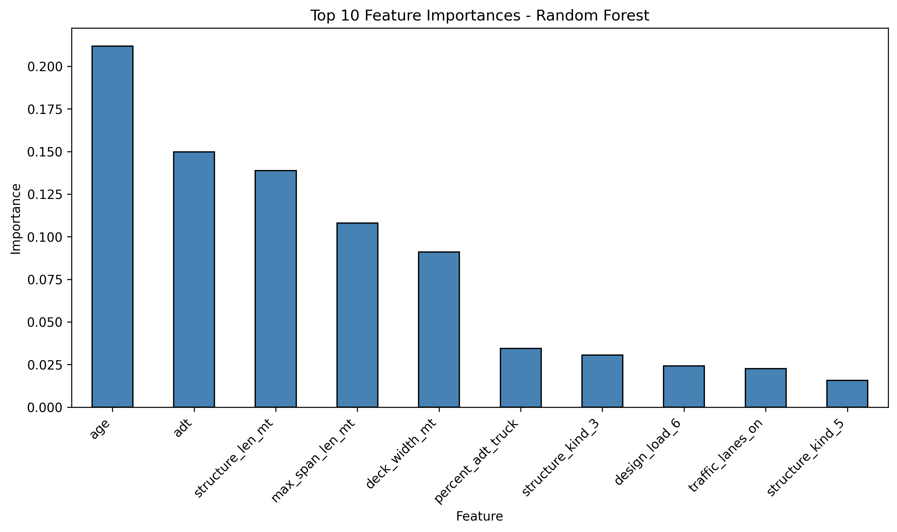

# **Bridge Condition Classification**  

## **Project Background**
This project analyzes the structural condition of bridges across Georgia, focusing on identifying bridges at risk of deterioration. The Department of Transportation (DOT) monitors bridge safety to ensure reliable and safe transportation infrastructure for the public. Understanding which bridges are most likely to be in Poor or Fair condition, how deterioration relates to age, traffic volume, and structural features, and which characteristics most influence risk helps the DOT prioritize inspections, allocate maintenance resources efficiently, and plan long-term infrastructure investments. Bridges in Poor condition — and to a lesser extent Fair condition — are higher priority for inspections and maintenance to prevent safety hazards and costly failures.
## **Objective**
Predict the condition of bridges (Good, Fair, Poor) using structural and traffic features to help the Department of Transportation prioritize inspections, allocate maintenance resources efficiently, and enhance public safety, with particular focus on identifying Poor and high-risk Fair bridges that require immediate attention. 

## Dataset Overview
This analysis uses real-world data from the [National Bridge Inventory (NBI)](https://www.fhwa.dot.gov/bridge/nbi.cfm), including information collected on 14987 Georgia bridges in 2021.

The original dataset contained hundreds of variables, many of which were identifiers or not directly related to bridge condition. It should be noted that `age` and `reconstructed` were derived through feature engineering. The final set of variables used in the analysis includes:

- `adt` – Average daily traffic
- `structure_len_mt` – Total bridge length in meters
- `deck_width_mt` – Deck width in meters
- `percent_adt_truck` – Percentage of truck traffic
- `max_span_len_mt` – Maximum span length in meters
- `age` – Calculated as `2021 - year_built`, representing the age of the bridge
- `bridge_condition` – Target variable indicating condition (Poor, Fair, Good)
- `structure_kind` – General type of bridge structure
- `structure_type` – Specific type of bridge structure
- `design_load` – Load rating/design category
- `functional_class` – Functional classification of the road the bridge carries
- `service_on` – Type of service or road
- `reconstructed` – Binary indicator if the bridge has ever been reconstructed

**Target Variable:**  
- `0 = Poor`  
- `1 = Fair`  
- `2 = Good`  

---

## **Model Overview**  
A **Random Forest Classifier** was trained on historical bridge data (~3,000 bridges).  
Key parameters:  
- Number of trees: 200  
- Class weights: balanced manually to give equal weight to Poor, Fair, and Good bridges  
- Random state: 0 (for reproducibility)  

A **custom threshold** of 0.05 was applied for predicting Poor bridges to increase detection sensitivity for this rare and critical class.  

---

## **Final Model Performance (Test Set)**  

| Class      | Precision | Recall | F1-Score | Support |
|------------|-----------|--------|----------|---------|
| Poor (0)   | 0.30      | 0.75   | 0.25     | 64      |
| Fair (1)   | 0.58      | 0.30   | 0.39     | 718     |
| Good (2)   | 0.85      | 0.88   | 0.87     | 2208    |

**Overall Accuracy:** 0.741  

**Interpretation:**  
- **Poor bridges:** The model correctly identifies **75% of all actual Poor bridges** (high recall), but **many bridges flagged as Poor are actually Fair or Good** (precision 30%). This is acceptable for safety-focused monitoring, where catching most Poor bridges is critical.  
- **Fair bridges:** Hardest to predict accurately; likely overlaps with Good/Poor features.  
- **Good bridges:** Predictions are very accurate, with high precision and recall.  

---

## **Key Drivers of Bridge Condition**  

The Random Forest model highlights the most important features influencing bridge condition:  

**Top Features:**  
1. **Age** – Older bridges are more likely to be Poor or Fair.  
2. **Average Daily Traffic (ADT)** – Bridges with higher traffic volumes tend to show more wear.  
3. **Bridge Length** – Longer spans are associated with higher structural risk.  

**Business Insight:**  
- Age, traffic, and structural dimensions are the primary drivers of bridge condition.  
- These features can guide targeted inspections and maintenance prioritization.  

---

## **Recommendations for Action**  
1. **Prioritize Poor bridges:** Even with moderate precision, high recall ensures most critical bridges are flagged for inspection as that was the most critical aspect of the project.  
2. **Further data collection:** Enhance features like material type, inspection history, and environmental factors to improve Fair and Poor class prediction. The problem of imblanced classes 
3. **Integrate into planning:** Use model outputs to allocate maintenance resources efficiently and reduce safety risks. Leverage the strategies and upkeep practices of well-performing bridges to improve maintenance and performance of lower-condition bridges
4. **Continuous monitoring:** Traffic data collection methods, standards, and metrics are constantly evolving. Update the model periodically with new inspection and traffic data to maintain accuracy. 

---

## **Next Steps / Future Enhancements**  
- Explore **permutation-based feature importance** to validate which features most influence test-set predictions.  
- Test **threshold optimization** or **cost-sensitive learning** to balance recall vs precision for Poor bridges.  
- Investigate **additional models** (XGBoost) for potential performance gains.  

